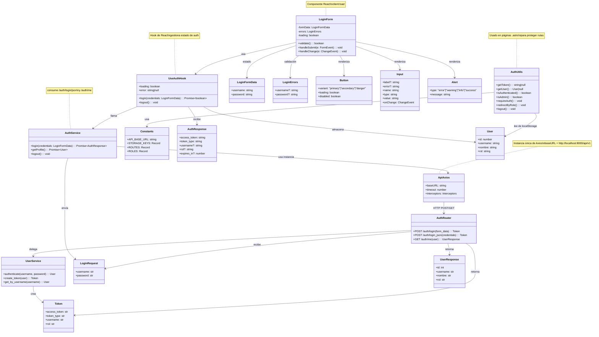

# Fase 4 — Diagrama de Clases

## Objetivo

Documentar las clases, interfaces, tipos y módulos principales del frontend (Astro + React + TypeScript) y su relación con el backend FastAPI durante el flujo de autenticación JWT.

---

## Diagrama de Clases



---

## Descripción de Clases Principales

### Frontend — Capa de Servicios

| Clase / Módulo | Archivo | Responsabilidad |
|---|---|---|
| `ApiAxios` | `services/api.ts` | Instancia única de Axios con `baseURL`, interceptores de petición (Bearer token) y respuesta (401 → redirect) |
| `AuthService` | `services/authService.ts` | Métodos `login()`, `getProfile()`, `logout()` que consumen los endpoints reales del backend |

### Frontend — Capa de Estado (Hooks)

| Clase / Módulo | Archivo | Responsabilidad |
|---|---|---|
| `UseAuthHook` | `hooks/useAuth.ts` | Hook de React que gestiona `loading`, `error`, llama a `authService`, guarda token en `localStorage`, obtiene perfil y redirige por rol |

### Frontend — Componentes UI

| Clase / Módulo | Archivo | Responsabilidad |
|---|---|---|
| `LoginForm` | `components/LoginForm.tsx` | Formulario controlado con validación, dispara `useAuth.login()` |
| `Input` | `components/Input.tsx` | Campo de texto reutilizable con label y error |
| `Button` | `components/Button.tsx` | Botón con variantes y estado `loading` |
| `Alert` | `components/Alert.tsx` | Mensaje de error/advertencia/info/éxito |

### Frontend — Utilidades

| Clase / Módulo | Archivo | Responsabilidad |
|---|---|---|
| `AuthUtils` | `utils/auth.ts` | Funciones para proteger rutas `.astro`: `requireAuth()`, `redirectByRole()`, `logout()`, `isAuthenticated()`, `isAdmin()` |
| `Constants` | `constants/index.ts` | `API_BASE_URL`, `STORAGE_KEYS`, `ROUTES`, `ROLES` |

### Frontend — Tipos TypeScript

| Tipo | Archivo | Campos |
|---|---|---|
| `LoginFormData` | `types/Login.ts` | `username: string`, `password: string` |
| `LoginErrors` | `types/Login.ts` | `username?: string`, `password?: string` |
| `AuthResponse` | `types/AuthResponse.ts` | `access_token`, `token_type`, `username?`, `rol?`, `expires_in?` |
| `User` | `types/User.ts` | `id: number`, `username: string`, `nombre: string`, `rol: string` |

### Backend — FastAPI

| Clase / Módulo | Archivo | Responsabilidad |
|---|---|---|
| `AuthRouter` | `routes/auth.py` | Endpoints `POST /auth/login`, `POST /auth/login/json`, `GET /auth/me` |
| `UserService` | `services/user_service.py` | `authenticate()`, `create_token()`, `get_by_username()` |
| `Token` | `schemas/auth.py` | `access_token: str`, `token_type: str`, `username: str`, `rol: str` |
| `LoginRequest` | `schemas/auth.py` | `username: str`, `password: str` |
| `UserResponse` | `schemas/user.py` | `id`, `username`, `nombre`, `rol` |

---

## Flujo de Dependencias

```text
LoginForm.tsx
  └── useAuth.ts
        └── authService.ts
              └── api.ts (Axios)
                    └── FastAPI /auth/login/json
                    └── FastAPI /auth/me
```

```text
admin/dashboard.astro
  └── utils/auth.ts
        └── constants/index.ts
        └── localStorage (token + user)
```

---

## Almacenamiento de Sesión

| Clave | Valor | Origen |
|---|---|---|
| `goecosystem_token` | JWT (`access_token`) | `POST /auth/login/json` |
| `goecosystem_user` | JSON del usuario | `GET /auth/me` |

Ambos se eliminan al hacer `logout()` o cuando el interceptor recibe un `401`.
