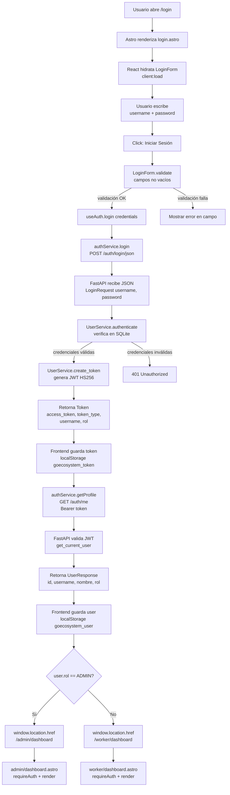
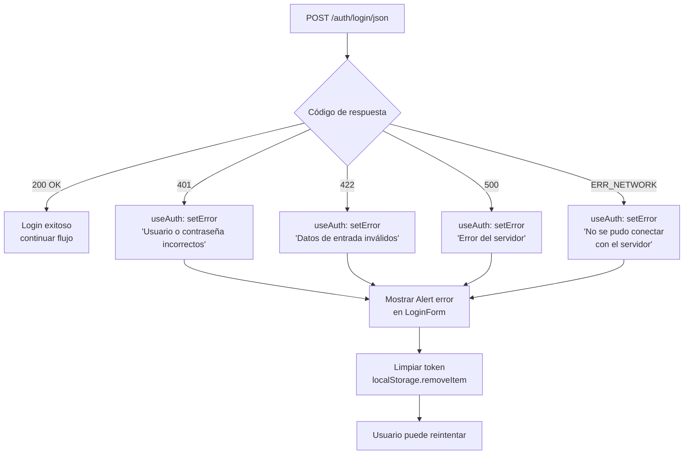
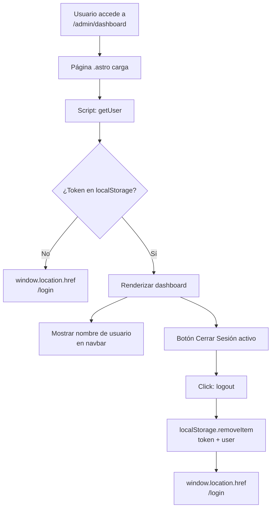
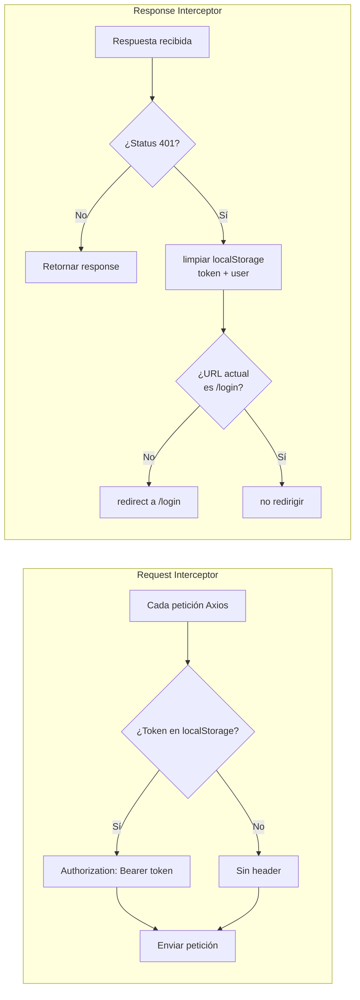
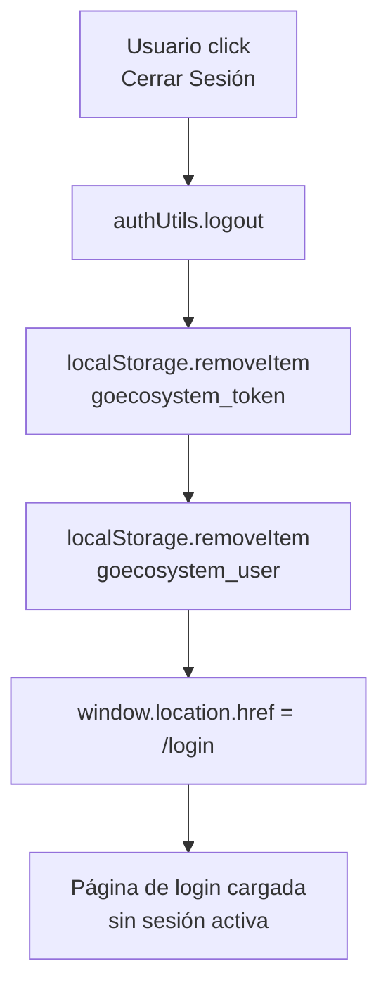
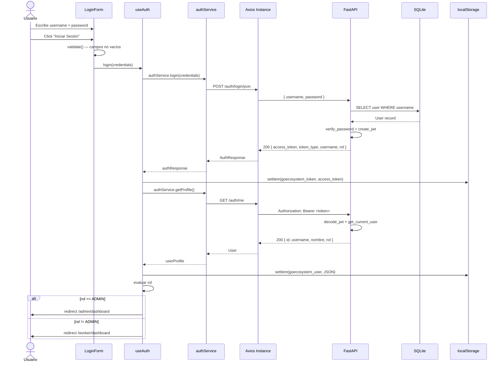

# Fase 4 — Diagrama de Flujo de Autenticación

## Objetivo

Documentar el flujo completo de autenticación JWT desde que el usuario abre la página de login hasta que es redirigido a su dashboard según su rol, incluyendo manejo de errores y cierre de sesión.

---

## Flujo de Login (Happy Path)

---

## Flujo de Errores de Login

---

## Flujo de Protección de Rutas

---

## Flujo del Interceptor de Axios

---

## Flujo de Cierre de Sesión

> **Nota:** El backend JWT es *stateless*, por lo que el logout se realiza únicamente en el frontend eliminando el token del `localStorage`. No hay llamada a un endpoint de logout en el servidor.

---

## Secuencia Completa (Diagrama de Secuencia)

---

## Endpoints Consumidos

| Método | Endpoint | Body / Header | Respuesta | Uso |
|---|---|---|---|---|
| `POST` | `/api/v1/auth/login/json` | `{ "username": "...", "password": "..." }` | `Token { access_token, token_type, username, rol }` | Autenticar y obtener JWT |
| `GET` | `/api/v1/auth/me` | `Authorization: Bearer <token>` | `UserResponse { id, username, nombre, rol }` | Obtener perfil del usuario autenticado |

---

## Casos de Prueba Cubiertos

| # | Caso | Resultado Esperado |
|---|---|---|
| 1 | Login admin (`admin` / `Admin123*`) | Redirect a `/admin/dashboard` |
| 2 | Login trabajador válido | Redirect a `/worker/dashboard` |
| 3 | Usuario inexistente | Alert: "Usuario o contraseña incorrectos" (401) |
| 4 | Contraseña incorrecta | Alert: "Usuario o contraseña incorrectos" (401) |
| 5 | Campos vacíos | Error en campo: "El nombre de usuario es obligatorio" |
| 6 | Acceso directo a `/admin/dashboard` sin token | Redirect a `/login` |
| 7 | Token expirado (401 en cualquier petición) | Interceptor limpia sesión y redirige a `/login` |
| 8 | Cerrar sesión | Limpia `localStorage` y redirige a `/login` |
| 9 | Backend caído | Alert: "No se pudo conectar con el servidor" (ERR_NETWORK) |
