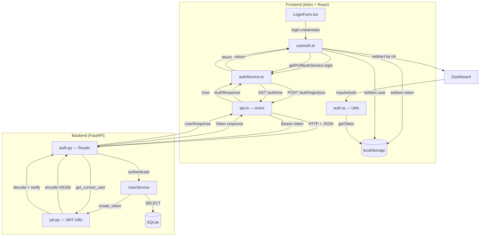
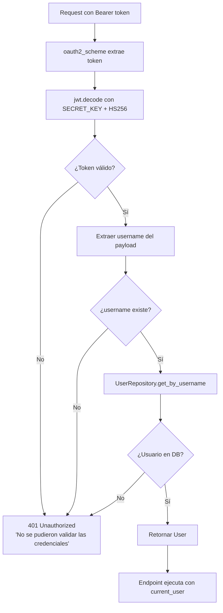
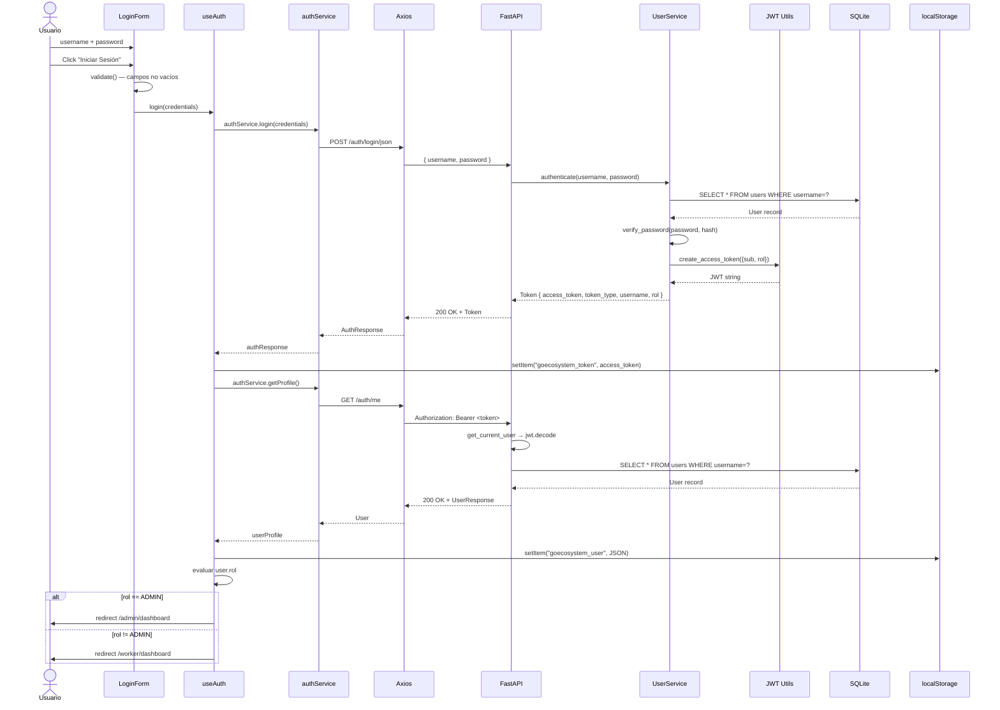
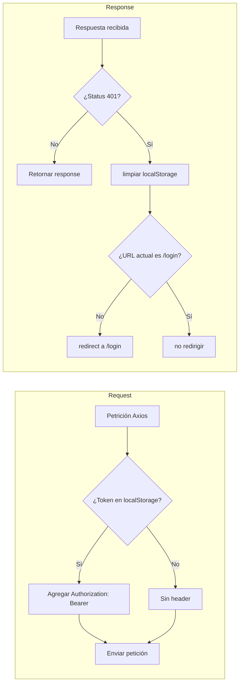
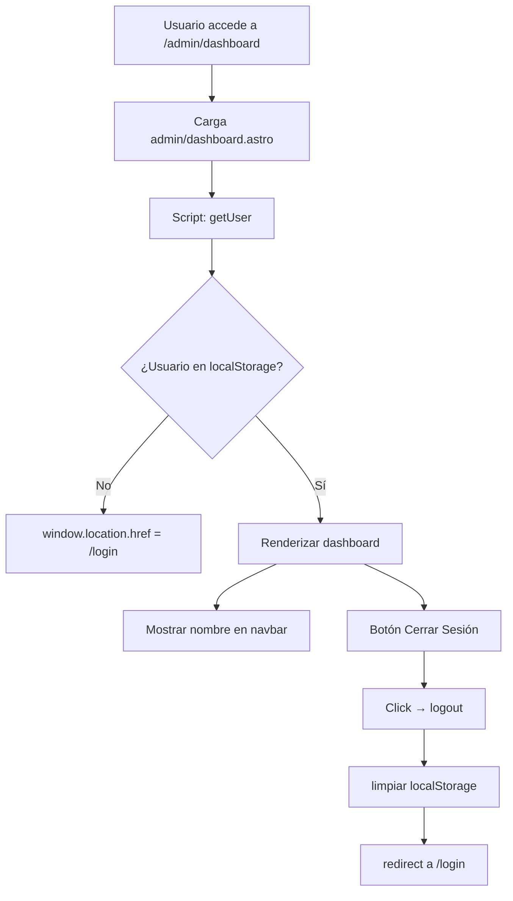
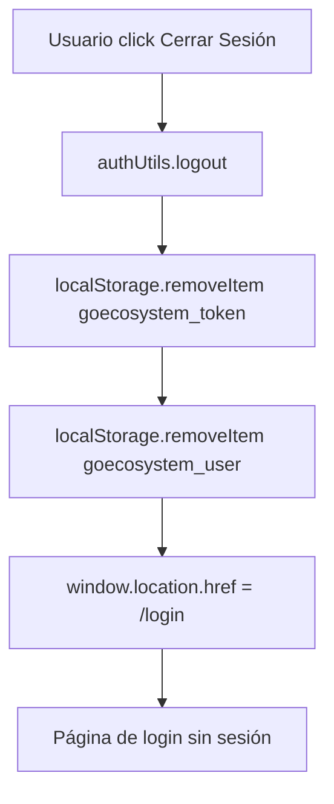
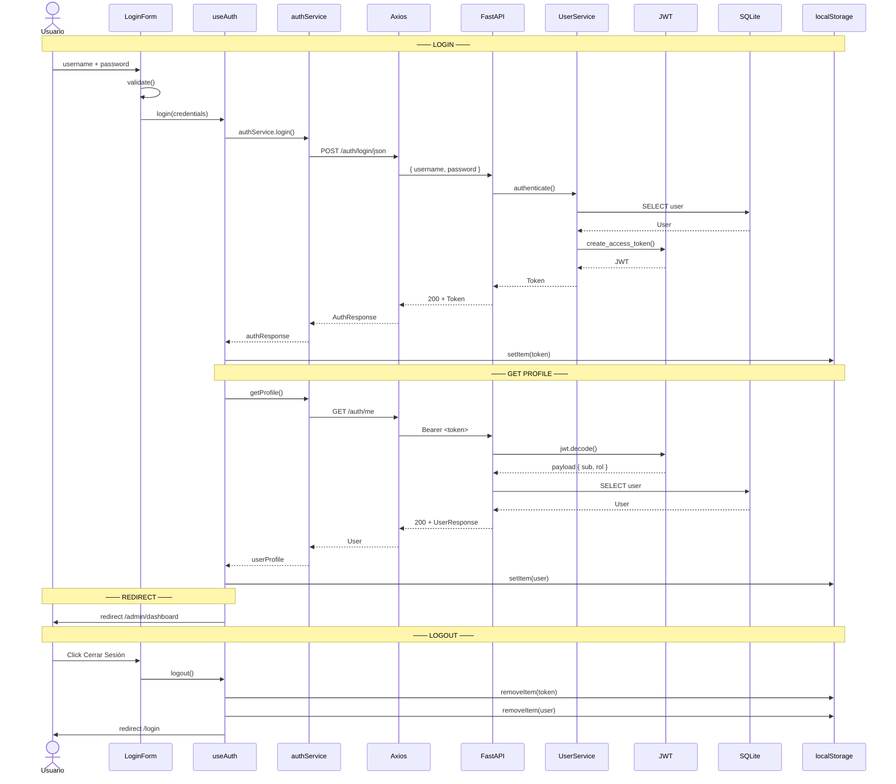

# Fase 4 — Documentación de Autenticación

## Objetivo

Documentar el sistema de autenticación JWT implementado en la Fase 4, cubriendo el flujo completo desde el frontend (Astro + React) hasta el backend (FastAPI), incluyendo generación de tokens, validación, almacenamiento, interceptores y protección de rutas.

---

## Índice

1. [Arquitectura de Autenticación](#1-arquitectura-de-autenticación)
2. [Generación del JWT (Backend)](#2-generación-del-jwt-backend)
3. [Validación del JWT (Backend)](#3-validación-del-jwt-backend)
4. [Flujo de Login (Frontend → Backend)](#4-flujo-de-login-frontend--backend)
5. [Almacenamiento de Sesión (Frontend)](#5-almacenamiento-de-sesión-frontend)
6. [Interceptores de Axios](#6-interceptores-de-axios)
7. [Protección de Rutas (Astro)](#7-protección-de-rutas-astro)
8. [Cierre de Sesión](#8-cierre-de-sesión)
9. [Configuración del Backend](#9-configuración-del-backend)
10. [Credenciales por Defecto](#10-credenciales-por-defecto)
11. [Endpoints de Autenticación](#11-endpoints-de-autenticación)
12. [Diagrama de Secuencia Completo](#12-diagrama-de-secuencia-completo)

---

## 1. Arquitectura de Autenticación



---

## 2. Generación del JWT (Backend)

**Archivo:** `backend/app/auth/jwt.py`

```python
from datetime import datetime, timedelta, timezone
from jose import jwt, JWTError
from app.core.config import settings

def create_access_token(data: dict, expires_delta: timedelta | None = None) -> str:
    to_encode = data.copy()
    expire = datetime.now(timezone.utc) + (
        expires_delta or timedelta(minutes=settings.ACCESS_TOKEN_EXPIRE_MINUTES)
    )
    to_encode.update({"exp": expire})
    return jwt.encode(to_encode, settings.SECRET_KEY, algorithm=settings.ALGORITHM)
```

### Parámetros del JWT

| Parámetro | Valor | Origen |
|---|---|---|
| `SECRET_KEY` | Clave secreta HS256 | `settings.SECRET_KEY` (`.env`) |
| `ALGORITHM` | `HS256` | `settings.ALGORITHM` |
| `ACCESS_TOKEN_EXPIRE_MINUTES` | `30` (default) | `settings.ACCESS_TOKEN_EXPIRE_MINUTES` |
| `exp` | Fecha de expiración | `datetime.now(UTC) + expires_delta` |

### Payload del JWT

```json
{
  "sub": "admin",
  "rol": "ADMIN",
  "exp": 1735689600
}
```

| Claim | Descripción |
|---|---|
| `sub` | Username del usuario (subject) |
| `rol` | Rol del usuario (`ADMIN` o `USER`) |
| `exp` | Timestamp de expiración |

---

## 3. Validación del JWT (Backend)

**Archivo:** `backend/app/auth/dependencies.py`

```python
from fastapi import Depends, HTTPException, status
from fastapi.security import OAuth2PasswordBearer
from jose import jwt, JWTError
from sqlalchemy.orm import Session
from app.core.config import settings
from app.database.session import get_db
from app.repositories.user_repository import UserRepository

oauth2_scheme = OAuth2PasswordBearer(tokenUrl="/api/v1/auth/login")

def get_current_user(
    token: str = Depends(oauth2_scheme),
    db: Session = Depends(get_db),
):
    credentials_exception = HTTPException(
        status_code=status.HTTP_401_UNAUTHORIZED,
        detail="No se pudieron validar las credenciales",
        headers={"WWW-Authenticate": "Bearer"},
    )
    try:
        payload = jwt.decode(token, settings.SECRET_KEY, algorithms=[settings.ALGORITHM])
        username: str = payload.get("sub")
        if username is None:
            raise credentials_exception
    except JWTError:
        raise credentials_exception

    user = UserRepository.get_by_username(db, username)
    if user is None:
        raise credentials_exception
    return user
```

### Flujo de Validación



---

## 4. Flujo de Login (Frontend → Backend)

### Paso a Paso

| Paso | Componente | Acción |
|---|---|---|
| 1 | `LoginForm.tsx` | Usuario escribe `username` + `password` y hace click en "Iniciar Sesión" |
| 2 | `LoginForm.tsx` | `validate()` verifica que los campos no estén vacíos |
| 3 | `useAuth.ts` | `login(credentials)` inicia el flujo |
| 4 | `authService.ts` | `POST /auth/login/json` con body `{ username, password }` |
| 5 | `api.ts` | Axios envía la petición con `Content-Type: application/json` |
| 6 | FastAPI `auth.py` | Recibe `LoginRequest(username, password)` |
| 7 | `UserService` | `authenticate(db, username, password)` verifica en SQLite |
| 8 | `UserService` | `create_token(user)` genera el JWT con `username` y `rol` |
| 9 | FastAPI | Retorna `Token { access_token, token_type, username, rol }` |
| 10 | `useAuth.ts` | Guarda `access_token` en `localStorage["goecosystem_token"]` |
| 11 | `authService.ts` | `GET /auth/me` con `Authorization: Bearer <token>` |
| 12 | FastAPI | `get_current_user` valida el JWT y retorna el `User` |
| 13 | `useAuth.ts` | Guarda el `User` en `localStorage["goecosystem_user"]` |
| 14 | `useAuth.ts` | Redirige según `user.rol`: `ADMIN` → `/admin/dashboard`, otro → `/worker/dashboard` |

### Diagrama de Secuencia



---

## 5. Almacenamiento de Sesión (Frontend)

### Claves de localStorage

| Clave | Valor | Tipo | Origen |
|---|---|---|---|
| `goecosystem_token` | JWT (`access_token`) | `string` | `POST /auth/login/json` |
| `goecosystem_user` | JSON del usuario | `string` (JSON) | `GET /auth/me` |

### Estructura del JSON de Usuario

```json
{
  "id": 1,
  "username": "admin",
  "nombre": "Administrador",
  "rol": "ADMIN"
}
```

### Funciones de Acceso (`utils/auth.ts`)

| Función | Descripción |
|---|---|
| `getToken()` | Lee `goecosystem_token` de `localStorage` |
| `getUser()` | Lee y parsea `goecosystem_user` de `localStorage` |
| `isAuthenticated()` | Retorna `true` si existe token |
| `isAdmin()` | Retorna `true` si `user.rol === "ADMIN"` |

---

## 6. Interceptores de Axios

**Archivo:** `src/services/api.ts`

### Interceptor de Petición (Request)

```typescript
api.interceptors.request.use((config) => {
  const token = localStorage.getItem(STORAGE_KEYS.TOKEN);
  if (token) {
    config.headers.Authorization = `Bearer ${token}`;
  }
  return config;
});
```

**Función:** Inyecta el header `Authorization: Bearer <token>` en **cada** petición que sale al backend, si el token existe en `localStorage`.

### Interceptor de Respuesta (Response)

```typescript
api.interceptors.response.use(
  (response) => response,
  (error) => {
    if (error.response?.status === 401) {
      localStorage.removeItem(STORAGE_KEYS.TOKEN);
      localStorage.removeItem(STORAGE_KEYS.USER);
      if (window.location.pathname !== ROUTES.LOGIN) {
        window.location.href = ROUTES.LOGIN;
      }
    }
    return Promise.reject(error);
  }
);
```

**Función:** Si cualquier petición recibe un `401 Unauthorized` (token expirado o inválido), limpia la sesión y redirige al login automáticamente.

### Diagrama de Interceptores



---

## 7. Protección de Rutas (Astro)

Las páginas `.astro` (dashboards) usan un script inline que verifica la sesión antes de renderizar el contenido.

### Patrón de Protección

```typescript
// En admin/dashboard.astro y worker/dashboard.astro
import { getUser, logout } from "../../utils/auth";

const user = getUser();
if (!user) {
  // Si no hay usuario, redirigir al login
  window.location.href = "/login";
}
```

### Flujo de Protección



---

## 8. Cierre de Sesión

### Frontend (`utils/auth.ts`)

```typescript
export function logout(): void {
  localStorage.removeItem(STORAGE_KEYS.TOKEN);
  localStorage.removeItem(STORAGE_KEYS.USER);
  window.location.href = ROUTES.LOGIN;
}
```

### Frontend (`authService.ts`)

```typescript
logout(): void {
  localStorage.removeItem("goecosystem_token");
  localStorage.removeItem("goecosystem_user");
}
```

### Nota Importante

> El backend JWT es **stateless**: no hay endpoint de logout ni blacklist de tokens. El cierre de sesión se realiza **únicamente en el frontend** eliminando el token del `localStorage`. Si el token no ha expirado, sigue siendo válido hasta que lo haga (30 minutos por defecto).

### Flujo de Logout



---

## 9. Configuración del Backend

**Archivo:** `backend/app/core/config.py` (o `backend/config.py`)

```python
class Settings:
    SECRET_KEY: str = "tu-clave-secreta-super-segura"
    ALGORITHM: str = "HS256"
    ACCESS_TOKEN_EXPIRE_MINUTES: int = 30
```

### Variables de Entorno (`.env`)

| Variable | Valor Default | Descripción |
|---|---|---|
| `SECRET_KEY` | — | Clave secreta para firmar el JWT |
| `ALGORITHM` | `HS256` | Algoritmo de cifrado |
| `ACCESS_TOKEN_EXPIRE_MINUTES` | `30` | Tiempo de expiración del token |

### CORS

```python
app.add_middleware(
    CORSMiddleware,
    allow_origins=["*"],
    allow_credentials=True,
    allow_methods=["*"],
    allow_headers=["*"],
)
```

> **Nota de seguridad:** En producción, `allow_origins` debe restringirse al dominio del frontend.

---

## 10. Credenciales por Defecto

| Usuario | Contraseña | Rol | Dashboard |
|---|---|---|---|
| `admin` | `Admin123*` | `ADMIN` | `/admin/dashboard` |
| *(crear via API)* | — | `USER` | `/worker/dashboard` |

### Inicialización de la Base de Datos

**Archivo:** `backend/app/database/init_db.py`

El script de inicialización crea el usuario `admin` por defecto con contraseña hasheada (`Admin123*`) y rol `ADMIN`.

---

## 11. Endpoints de Autenticación

| Método | Endpoint | Content-Type | Body / Header | Respuesta | Descripción |
|---|---|---|---|---|---|
| `POST` | `/api/v1/auth/login` | `application/x-www-form-urlencoded` | `username=...&password=...` | `Token` | Login con OAuth2 (Swagger UI) |
| `POST` | `/api/v1/auth/login/json` | `application/json` | `{ "username": "...", "password": "..." }` | `Token` | Login con JSON (**usado por el frontend**) |
| `GET` | `/api/v1/auth/me` | — | `Authorization: Bearer <token>` | `UserResponse` | Perfil del usuario autenticado |

### Schema `Token`

```json
{
  "access_token": "eyJhbGciOiJIUzI1NiIsInR5cCI6IkpXVCJ9...",
  "token_type": "bearer",
  "username": "admin",
  "rol": "ADMIN"
}
```

### Schema `UserResponse`

```json
{
  "id": 1,
  "username": "admin",
  "nombre": "Administrador",
  "rol": "ADMIN"
}
```

---

## 12. Diagrama de Secuencia Completo



---

## Resumen

| Aspecto | Implementación |
|---|---|
| **Algoritmo JWT** | HS256 |
| **Expiración del token** | 30 minutos (configurable) |
| **Almacenamiento frontend** | `localStorage` (`goecosystem_token`, `goecosystem_user`) |
| **Endpoint de login (frontend)** | `POST /auth/login/json` (JSON body) |
| **Endpoint de login (Swagger)** | `POST /auth/login` (form-urlencoded) |
| **Endpoint de perfil** | `GET /auth/me` (Bearer token) |
| **Protección de rutas** | Script inline en `.astro` que verifica `localStorage` |
| **Interceptor 401** | Limpia sesión y redirige a `/login` |
| **Logout** | Solo frontend (sin endpoint backend, JWT stateless) |
| **Redirect por rol** | `ADMIN` → `/admin/dashboard`, otro → `/worker/dashboard` |
